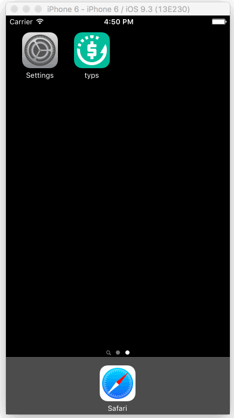

# *typs*: Tip Calculator + Restaurant Logger

**typs** is a Tip Calculator + Restaurant Logger app for iOS submitted as the pre-work requirement for [CodePath iOS Bootcamp](http://codepath.com/iosbootcamp). It is also available on the App Store [here](https://appsto.re/us/e2aqeb.i)

It does more than just calculate tips... It is capable of knowing the restaurant you are dining at based on your current location and also allows you to save each check to build your dining history for review later on.

Submitted by: **Monte Thakkar**

Time spent: **60+ passionate** hours spent in total

Status: currently v1.1 in development. Please send any feedback or suggestions to **helloomonte@gmail.com**

App Store: [typs by Manthan Bharat Thakkar](https://appsto.re/us/e2aqeb.i)

## User Stories

The following **required** functionality is complete:
* [x] User can enter a bill amount, choose a tip percentage, and see the tip and total values.
* [x] Settings page to change the default tip percentage.

The following **additional** features are implemented:
* [x] History view to review all your saved checks
* [x] UI animations for saving checks and toggle tax-included in settings
* [x] Remembering the bill amount across app restarts (using Realm)
* [x] Saving checks with information such as total bill amount, party size etc (using Realm)
* [x] Using Yelp API to get current restaurant/bar from lat & long of user's current location
* [x] Pan & Tap gesture recognizers for simple and intuitive controls
* [x] Allows inclusion/exclusion of taxes in tip calculation
* [x] Using 'kSystemSoundID_Vibrate' from class 'AudioToolbox' for more interactive UX
* [x] Supports party size up to 9 people

Coming soon:
* [ ] Using locale-specific currency and tax percentage
* [ ] Improved Yelp location search to produce more accurate restaurant results for current location

## Video Walkthrough

Here's a working demo of the app:

GIF created with [LiceCap](http://www.cockos.com/licecap/).

## Notes

This app was fairly straighforward to implement. I focused on two main areas while building this app:

1. Minimalistic design: trying to keep the UI as clean and simple as possible. The app uses mostly only two colors with up to 75% of the views filled up with white space.
2. Intuitive UX: Using pan and tap gestures almost everywhere to receive input to eliminate the use of keyboards. This makes the app's user experience more consistent and interactive.

Side Note: This is my first app on the App store. I am constantly working on improving the app to make it more intituitive and functional. If you have any feedback or suggestions, please email them to **helloomonte@gmail.com**

## License

    Copyright [2016] [Monte Thakkar]

    Licensed under the Apache License, Version 2.0 (the "License");
    you may not use this file except in compliance with the License.
    You may obtain a copy of the License at

        http://www.apache.org/licenses/LICENSE-2.0

    Unless required by applicable law or agreed to in writing, software
    distributed under the License is distributed on an "AS IS" BASIS,
    WITHOUT WARRANTIES OR CONDITIONS OF ANY KIND, either express or implied.
    See the License for the specific language governing permissions and
    limitations under the License.
